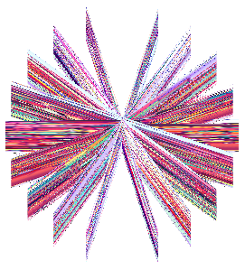
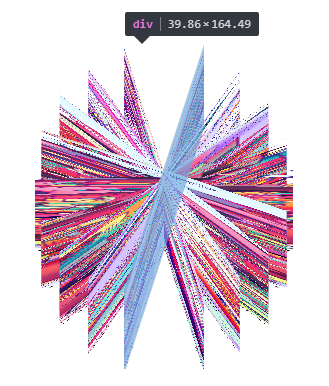
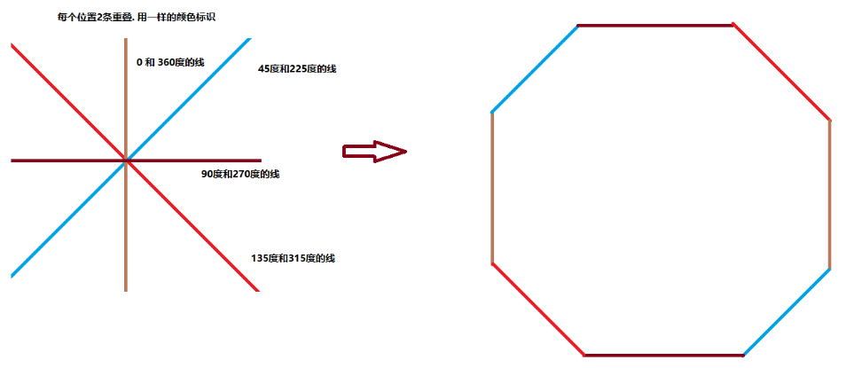
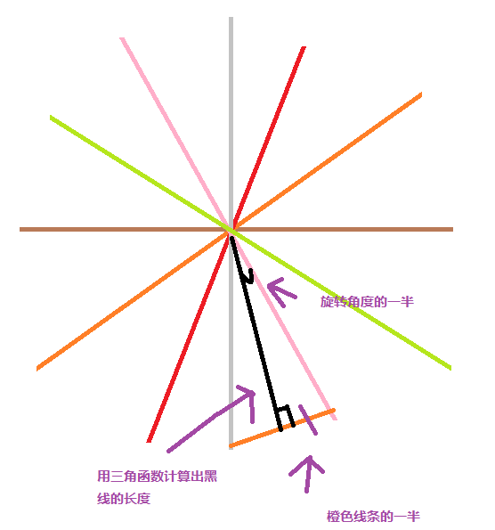

## 一、 载入图片, 定位至统一位置
>因为20张图片被定位到统一地方, 所以所有图片都叠在一起了

>此时效果


## 二、依照Y轴旋转图片
>先说下为什么要依照y轴:  我们需要把图片围绕成一个环形, 类似于 木桶的每一块木板,   图片就是木板, 按图片的顺序旋转自各自的角度, 目前也是原地旋转, 所以图片依旧叠加在一起

>素材有20张图片, 那每张的旋转角度就是 360 / 20 = 18度, 每张旋转的度数在前一张的基础上累加 18 度, 

>这里注意注意注意: 因为是按图片中心的Y轴旋转, 所以同一个度数会有两张图片,  比如: 0度的图片, 头在0度, 尾在90度,    然后当轮到头在90度的图片时, 他的尾在 0 度, 所以会有同一个度数两张图片的现象


>此时效果


>为了方便理解, 切换成上帝视角, ,  所有图片围绕中心点旋转






## 三、将图片沿着各自Z轴向外推
>现在木板(也就是每一张图片)是穿插在一起的, 我们需要让他们远离中心点, 拉开距离, 让他,们边缘连接而不是这样交叉在一起,  才能形成一个圆

### 先了解每一块木板怎么推
>简单的画了个前后的效果图,  用的是上帝视角, 也就是你低头看一个木桶的视角





### 如何计算该推多少距离
>做一道三角函数数学题
>
>画的角度不太对别介意



>设一共12条线,  每条长200px(此时的长就对应图片的宽) ,  求将橙线移动到图中最终位置的距离 "黑线",
```
// 先求旋转度数
// 然后取度数的一半
360 / 12 / 2 = 15 度
// 得知直角底边长度
200 / 2 = 100px
// 根据度数得知 tan, 顺便说下, tan是对边比邻边
tan15°= 0.26794
// 求出黑线
100PX / 黑线 = 0.26794
黑线约等于 373.2px
```

## js计算时注意
1. Math.tan 接收的是弧度单位
2. Math.PI 表示的是一个 Π
3. 360度 = 2Π 
>计算出每张图片之间的形成的弧度
```
 // 假设图片数量是 8 张
// 因为 360 = 2Π
// 1度 = Π / 180
// 每份的角度是
const deg = 360 / 8 // 此时为 45
// 一份的弧度就是 每份弧度 * 旋转角度的一半
// 最后结果就等于 Π / 图片数量
( Math.PI / 180 ) * ( 45 / 2 )  ==>  Math.PI / 8
```

