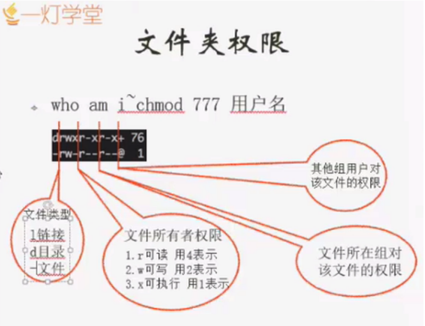

## 基本知识
* linux 没有盘符, 只有区的概念
* 用户名 `root` 拥有最高权限

### 路径知识
* Linux下文件前带`.`表示隐藏文件
* 一个`.`代表当前目录, 两个`..`代表上级目录

## 路径操作
> a是显示隐藏文件, l是显示长列表格

命令 | 说明
---|---
ls 或 dir | 查看当前目录内容
ls -l  | 显示长格式目录, 有创建时间,修改信息, 文件大小
ls -a | 显示隐藏文件
ls -al | 查看目录所有对应的权限( )
pwd | 宣誓当前目录的全部路径
cd ~ | 进入到当前分配`home`目录下的用户区域, 比如`/home/nxl`
cd / | 进入系统的根目录

## 文件操作
* [old] 表示旧文件       
* [new] 表示操作后的文件     
* [target] 目标文件        
* [targetDir] 目标目录

命令 | 说明
---|---
mkdir | 创建文件夹
rmdir | 删除文件
touch [new] | 创建文件
rm [target] | 删除文件
rm -r [targetDir] | 删除文件夹
rm -rf * | 删除所有内容(r递归, f强制)
cp [old] [test/new] | 复制文件
cp [old] -R [test/new] | 复制目录 
ln -s old new  | 建立软链

## 界面切换操作 init [number]
命令 | 说明
---|---
0  | 关机
1 | 单用户
2 | 多用户状态没有网络服务
3 | 多用户状态有网络服务(就是平时的小黑窗)
4 |  系统未使用保留给用户
5 | 图形界面
6 | 系统重启

## 系统操作
命令 | 说明
---|---
shutdown -h now  | 立刻关机
shutdown -r now /reboot | 立刻重启计算机
su - root | 先用普通账户登录再切换 sudo临时已管理员操作
logout | 用户注销

## vim 操作
命令 | 说明
---|---
vi [target] | 编辑目标文件
cat [target] | 查看文件内容
i| 在当前光标所在字符的前面，转为输入模式；
a| 在当前光标所在字符的后面，转为输入模式；
o| 在当前光标所在行的下方，新建一行，并转为输入模式；
I|在当前光标所在行的行首，转换为输入模式
A|在当前光标所在行的行尾，转换为输入模式
O|在当前光标所在行的上方，新建一行，并转为输入模式；
esc | 退出编辑, ubuntu 需要 `esc+:`
## 文件夹权限操作

## 常用命令截图

