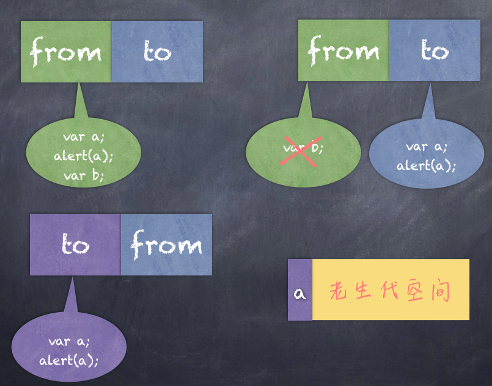
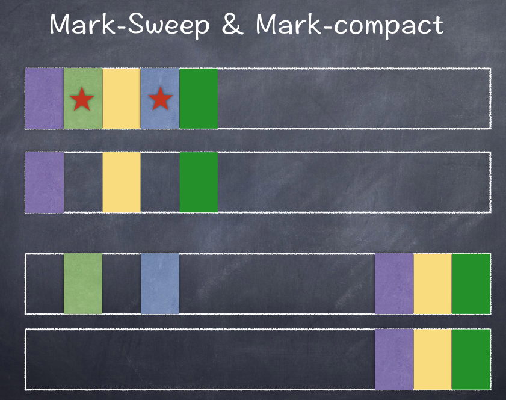
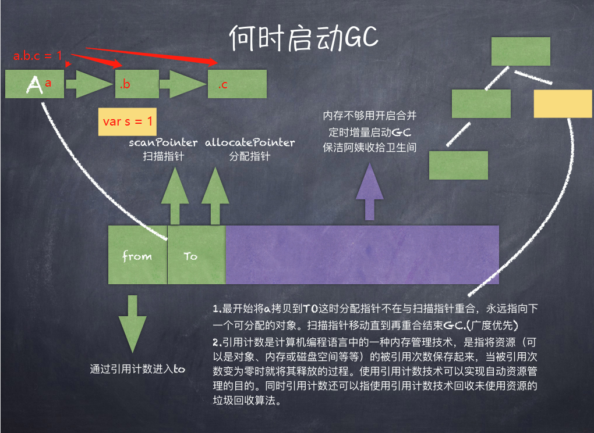

# GC

## V8垃圾回收机制
* Node使用JavaScript在服务端操作大内存对象受到了一定的限制(堆区)，64位系统下约为1.4GB，栈区32位操作系统下是0.7G 

* 新生代64位是32M 32位是16M
  * node —max-new-space-size app.js:
  * -max-old-space-size app.js


* Process.memoryUsage->rss、heaptTotal、heapUsed
* V8的垃圾回收策略主要基于分代式垃圾回收机制。在自动垃圾回收
的演变过程中，人们发现没有一种垃圾回收算法能够胜任所有场景。
V8中内存分为新生代和老生代两代。新生代为存活时间较短对象，
老生代中为存活时间较长的对象。

* 一句话表示：小孩子尽管玩，到处丢东西大人收。


在语言发展过程中， 人们发现没有一种垃圾回收机制可以适应所有的场景，  比如Go语言就是双GC， 而我们的v8 分为新生代和老生代

NodeJs 设置大内存对象上限也是有原因的， 一是， 浏览器上很少有人上传几个G的大文件， 二是， 越大的空间 执行回收所花的时间越长


### 新生代 · Scavenge算法
在分代基础上，新生代的对象主要通过Scavenge算法进行垃圾回收，再具体实现时主要采用Cheney算法。Cheney算法是一种采用复制的方式实现的垃圾回收算法。它将内存一分为二，每一个空间称为semispace。这两个semispace中一个处于使用，一个处于闲置。处于使用的称之为From,闲置的称之为To.分配对象时先分配到From,当开始进行垃圾回收时，检查From存活对象赋值到To.非存活被释放。然后互换位置。再次进行回收，发现被回收过直接晋升，或者发现To空间已经使用了超过25%。他的缺点是
只能使用堆内存的一半，这是一个典型的空间换时间的办法，但是新生代声明周期较短，恰恰就适合这个算法。

**自己描述**

scavenge 将内存一分为二， 比如64位是32M ， 那from 和 to 就分别被分配了 16M , 当from 堆满时进行一次GC回收， 通过引用计数的方法它把仍在使用的变量挪到 to 中， 留下未被使用的在from , 然后from 和 to交换位置， 然后清空from, 你会问会什么要互相交换再删除呢， 干嘛不直接删除， 因为新生代要一直对变量进行操作然后晋升, 还有很多新的内存申请, 并且需要记录交替的次数

那什么时候将新生代的内存迁移至老生代呢：

1. 当from 挪至 to 的过程中， 发现to 已经被占了25% 以上了，
2. from 和 to 交替5次以上




### 老生代 · Mark-Sweep & Mark-compact
V8老生代主要采用Mark-Sweep和Mark-compact,在使用Scavenge不合适。一个是对象较多需要赋值量太大而且还是没能解决空间问题。Mark-Sweep是标记清楚，标记那些死亡的对象，然后清除。但是清除过后出现内存不连续的情况，所以我们要使用Mark-compact，他是基于Mark-Sweep演变而来的，他先将活着的对象移到一边，移动完成后，直接清理边界外的内存。当CPU空间不足的时候会非常的高效。V8后续还引入了延迟处理，增量处理，并计划引入并行标记处理。


**自己描述**


老生代使用的是标记清除( Mark-Sweep )， 它会给不再使用的内存打上标记， 标记完以后删除， 但是删除后会出现内存的不连续， 就会造成内存的浪费

所以当 Mark-Sweep 使用内存占满了不够用时，  就用到了 Mark-compact , 他将仍被使用的内存挪挪挪 ，  挪到一起，相当于压缩，  让内存使用保持连续， 然后删除未被移动的内存

老生代的回收是间歇性的， 一会来一次， 并不会像JAVA那样一口气回收,  为什么不一次性回收呢， 应为在回收期间， 程序会暂停





## 何时启动GC 
> 当我们把变量赋值为Null 并不会立即的对变量进行GC， 而是等到下一次的GC

比如我在代码中定义了这两个变量
```
var a = {
  b: {
    c: 1
  }
}

var s = 1

console.log(a.b.c)
```

并且 a 在后续的代码中继续被使用, 而 s 没有

当代码读到 此处时，  这两个变量就进入到了新生代空间，  然后 利用引用技术将其从from 往to里去挪， 但是谁来帮忙挪呢， 这里有两个指针

1. 扫描指针
2. 分配指针

刚开始， 扫描指针和分配指针是重合的,  然后扫描指针开始扫描，  分配指针原地不动

扫描指针找到了 s， 发现它在这，但并没有引用，因此就不处理， 然后继续扫描， 发现了 a 变量， 继而发现a 内部还有b 引用（ 扫描指针按`词法作用域`进行广度优先遍历 ）， 其实到此处就开始分配空间了， 但这里我们继续往下说， 扫描指针继续往下最末尾找到 c， 发现c有引用，  此时， 分配指针开始干活了， 将c 放到分配指针处 ，然后分配指针开始移动，  c 上面的b 放到分配指针处， 然后又移动分配指针，  a 也是同理

全部找完之后， 扫描指针挨个扫描已被分配的内存， 看看是否都被遍历过， 最后扫描指针又和 分配指针重合 





**老袁的引用计数demo**


## 查看Node js 内存使用
```
Process.memoryUsage
rss ：所有内存使用包括堆区和栈区
heaptTotal：堆区占用内存
heapUsed：已使用到的堆部分
external: V8引擎C++对象占用
(GC动态变化)
```

## 内存泄露分析
```
node-inspector

console.log("Server PID", process.pid);

sudo node --inspect app.js

while true;do curl "http://localhost:1337/"; done

top -pid 2322
```


## 常见内存泄露问题

1. 无限制增长的数组
2. 无限制设置属性和值
3. 任何模块内的私有变量和方法均是永驻内存的 a = null
4. 大循环，无GC机会


## 小知识
* V8内存管理实例对象时， 会给创建的实例分配指针指向， 保持单例的状态， 防止内存泄漏， 也就是说创建的多个实例实际上只创建了一个