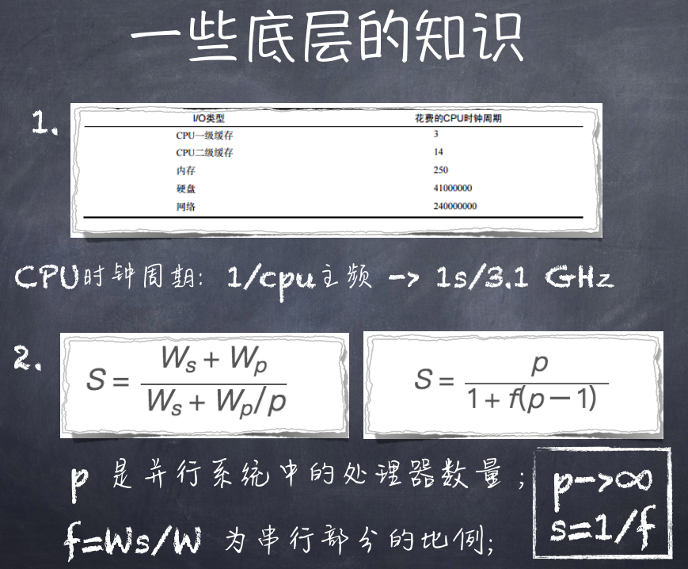
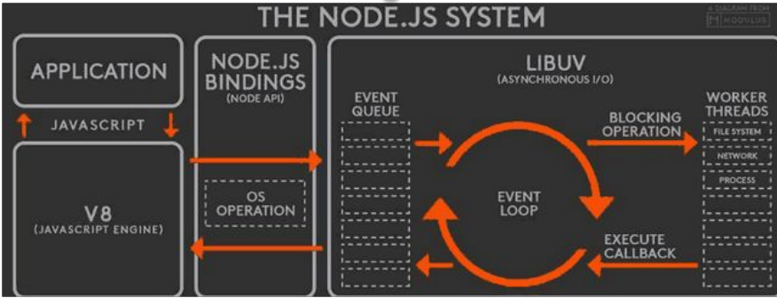
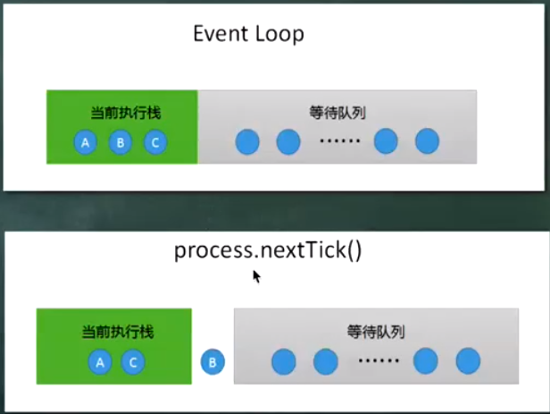

# NodeJs架构


## 异步IO的好处

* 前端通过异步IO可以消除UI堵塞。
* 假设请求资源A的时间为M,请求资源B的时间为N.那么同步的请求耗时为M+N.如果采用异步方式占用时间为Max(M,N)。
* 随着业务的复杂，会引入分布式系统，时间会线性的增加，M+N+...和Max(M,N…)，这会放大同步和异步之间的差异。
* I/O是昂贵的，分布式I/O是更昂贵的。
  * 分布式因为你读取到了这个值， 但并没有在你这台机器上， 远程的机器想要读取到那就必须要走网络， 这个过程就变长了
* NodeJS 适用于IO密集型不适用CPU密集型


IO密集型就是需要频繁请求的程序，高访问量，  CPU密集型就是需要进行大量计算的 

##  底层的知识
1. CPU时钟周期：1/cpu主频 -> 1s/3.1 GHz



3. 操作系统对计算机进行了抽象，将所有输入输出设备抽象为文件。内核在进行文件I/O操作时，通过文件描述符进行管理。应用程序如果需要进行IO需要打开文件描述符，在进行文件和数据的读写。异步IO不带数据直接返回，要获取数据还需要通过文件描述符再次读取。


## Node对异步IO的实现
> 完美的异步IO应该是应该是应用程序发起非阻塞调用，无需通过遍历或者事件幻想等方式轮询。

Node.js 的事件循环和在浏览器中的实现不太一样， 在Node.js 中事件循环交给了Libuv托管，  Libuv 和 v8 是分别独立的线程， 辅助Node.js 进行事件轮询

Node.js 依靠v8运行javascript, 并且绑定了底层的操作系统

当用户的请求进来，加入事件的队列， EventLoop 开始旋转， 将事件逐个放入右边的队列中， 如果是异步的文件操作的话就使用系统的文件描述符进行异步操作， 当操作完成后执行callback 返回左边的队列中， 


原理结构图



## 几个特殊的API
1. SetTimeout和SetInterval 线程池不参与
2. process.nextTick() 实现类似SetTimeout(function(){},0);每次调用放入队列中，在下一轮循环中取出。
3. setImmediate();比process.nextTick()优先级低


来看看这段代码

```
setTimeout(() => {
  console.log(1)
}, 0)

setImmediate(() => {
  console.log(2)
})

process.nextTick(() => {
  console.log(3)
})

new Promise((resolve, reject) => {
  console.log(4)
  resolve(4)
}).then(() => {
  console.log(5)
})

console.log(6)
```

这道题目的答案是 463512

这里有几个注意点， 第一就是 nextTick ，它的优先级比 promise.then 要高， 如下图， 它加入队列的方式属于插队行为, 它直接加入到了当前执行栈（同步队列）与 下一次的等待执行栈之间



我们都知道 then 比 setTimeout 优先级高

然后就是 setTimeout 和 setImmediate 的问题了， 当setTimeout 设置为0时， 他们都是放在队列最后,  所以执行顺序就是谁先写就先执行谁了， 但当setTimeout 设置的时间大于0 时（最低延迟会被忽略）， 情况就不一样了， setTmmediate 会先被执行


## 函数式编程在Node中的应用
1. 高阶函数：可以将函数作为输入或者返回值，形成一种后续传递风格的结果接受方式，而非单一的返回值形式。后续传递风格的程序将函数业务重点从返回值传递到回调函数中。
```
  app.use(function(){//todo})。
  var emitter = new events.EventEmitter;
  emitter.on(function(){//……….todo})
```

2. 偏函数：指定部分参数产生一个新的定制函数的形式就
是偏函数。Node中异步编程非常常见，我们通过哨兵变量
会很容易造成业务的混乱。underscore，after变量


这里偏函数和偏应用函数经常会搞混，  偏函数是一种数学概念， 参数保持单个，   而偏应用函数是偏函数在实际中的应用， 在js中因为没有重载之类的概念，所以不会分的很细

然后哨兵变量就是在函数外部顶上写个 var 变量， 然后函数内部去修改他使用他， 但是这样很容易被其他逻辑修改， 并且别人也不知道你这个 var 是干嘛的

## 常用的Node控制异步技术手段
1. Step、wind（提供等待的异步库）、Bigpipe、Q.js
2. Async、Await
3. Promise/Defferred是一种先执行异步调用，延迟传递的处理方式。Promise是高级接口，事件是低级接口。低级接口可以构建更多复杂的场景，高级接口一旦定义，不太容易变化，不再有低级接口的灵活性，但对于解决问题非常有效
4. 由于Node基于V8的原因，目前还不支持协程。协程不是进程或线程，其执行过程更类似于子例程，或者说不带返回值的函数调用。一个程序可以包含多个协程，可以对比与一个进程包含多个线程，因而下面我们来比较协程和线程。我们知道多个线程相对独立，有自己的上下文，切换受系统控制；而协程也相对独立，有自己的上下文，但是其切换由自己控制，由当前协程切换到其他协程由当前协程来控制。

Promise 是一个语法， 规范， js只是实现了这个规范，  Promise 是一个高级接口， 创建一次，不容易修改， then就是 低级接口， 可以一直then ,处理逻辑

