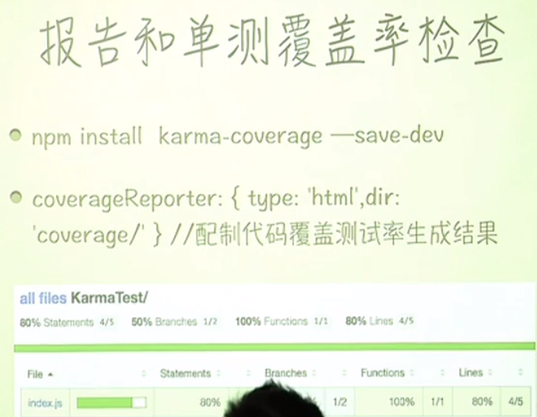

# 单元测试
随着Web应用的复杂度变得越来越高，为了保证稳定性和代码质量，大型项目和大公司都越来越重视单元测试， 单元测试可以让我们前端人员将魔爪伸到测试领域， 这是普通前端工程师迈向高级工程师的必经之路

## 开发模式描述

#### ✈TDD：测试驱动开发
> （Test-Driven Development）

测试驱动开发时敏捷开发中的一项核心实践和技术， 也是一种设计方法论。 TDD的原理时在开发功能代码之前， 先编写单元测试用例代码， 测试代码确定需要编写什么产品代码。 TDD的基本思路就是通过测试来推动整个开发的进行， 但测试驱动开发不只是单纯的测试工作， 而是把需求分析、设计、质量控制量化的过程。 TDD首先考虑使用需求（对象、功能、过程、接口等）， 主要是编写测试用例框架对功能的过程和接口进行设计， 而测试框架可以持续进行验证

TDD关注所有的功能是否被实现(每一个功能都必须有对应的测试用例), suite配合test利用assert('tobi' === user.name);

#### 🚀BDD：行为驱动开发
> （Behavior Driven Development）

行为驱动开发是一种敏捷软件开发的技术， 它鼓励软件项目中的开发者、QA和非技术人员或商业参与者之间的协作。主要是从用户的需求出发， 强调系统行为。 BDD最初是由Dan North 在2003年命名， 它包括验收测试和客户测试驱动等的极限编程的实践， 作为对测试驱动开发的回应。

BDD关注整体行为是否符合整体预期, 编写的每一行代码都有目的提供一个全面的测试用例集。

#### 🚠ATDD：验收测试驱动开发
> （Acceptance Test Driven Development）

TDD只是开发人员的职责， 通过单元测试用例来驱动功能代码的实现。 在准备实施一个功能或特性之前， 首先团队需要定义出期望的质量标准和验收细则， 以明确而且达成共识的验收测试计划 （包含一系列测试场景） 来驱动开发人员的TDD实践和测试人员的测试脚本开发。 面向开发人员， 强调如何实现系统以及如何检验

## 单元的概念
单元就是一个小单位， 你的一个函数可以作为一个单元， 你的一个文件、模块、组件也可以作为一个单元， 只要是可以组合拆解的组件都可以称之为单元， 具体怎么定义还得看你的具体需求

## 单测的目的
单元测试的目的也是单元测试的优势， 可以使我们的代码更具有健壮性， 更加不容易出错，开发阶段就可以规避了大部分的问题，让开发者对自己的程序运行结果了如指掌

## 单测的原则
* 单一职责
* 接口抽象
* 层次分离
* 测试代码时，只考虑测试，不考虑内部实现
* 数据尽量模拟现实，越靠近现实越好
* 充分考虑数据的边界条件
* 对重点、复杂、核心代码，重点测试
* 利用AOP(beforeEach、afterEach),减少测试代码数量，避免无用功能
* 测试、功能开发相结合，有利于设计和代码重构

## 测试框架

#### 🎰unit 单元测试
* `karma` 
* `jest` [比较好搭配react]
* `Intern` [大而全的单元测试框架]

#### 🌗e2e 端对端测试
* `selenium-webdriver`
* `nightwatchjs` [大型项目]
* `rize` [基于puppteer]

#### 🎨UI测试
* `backstopjs`

#### 📱兼容测试
* `f2etest` [多浏览器兼容性测试整体解决方案]

## 断言库

## 了解单元测试的优势
#### 👍正确性       
测试代码的稳定性正确性, 保证系统程序的稳定运行， 规避错误，就可以使得网站更稳定流畅的运行，还能大幅节省重复手动调试的时间

#### 🕔自动化
自动化测试的优势就在于可以省去开发者无意义的重复`console.log`等等的辛苦的手动调试， 辛苦又容易对代码结构造成破坏， 单元测试的核心就是非入侵式的

#### 💬 解释性
测试用例用于测试接口、模块的重要性， 那测试用例中就会有该API或者是模块的使用流程说明， 这也方便了其他参与开发的开发者阅读， 详细的过程描述会比注释以及文档更让人容易理解

#### 🔫 驱动开发
TDD 测试驱动开发: 在开发功能代码之前，先编写单元测试用例代码，测试代码确定需要编写什么产品代码。
这样的开发模式有很强的规范性， 因为必须保证代码的可测试性， 有助于团队的规范统一

#### 🙉 保证重构
互联网产品必然经历迭代重构的过程， 写好测试用例方便将来重构的开发人员， 也方便当下负责重构的你， 有测试用例做后盾大胆的进行重构

 

***

## 课堂截图

