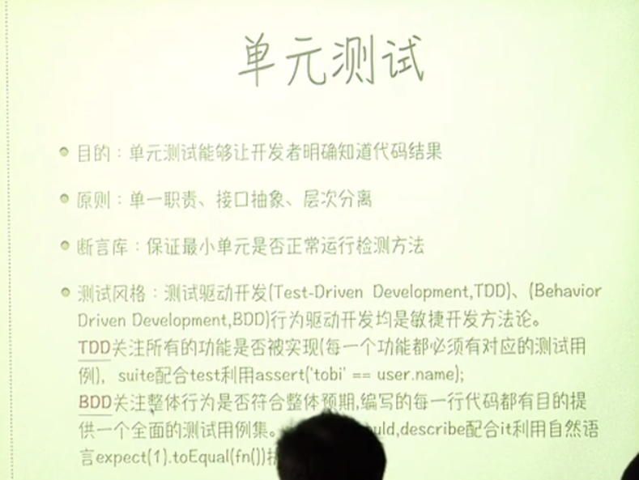
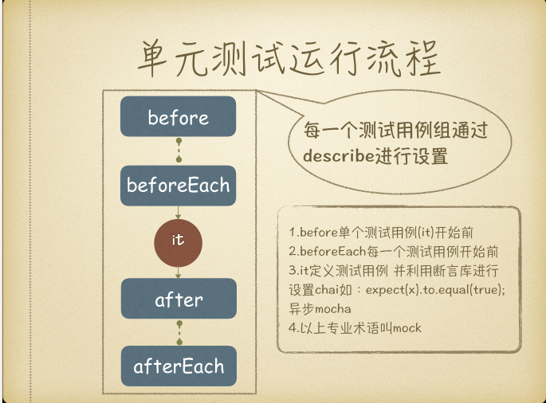

# 单元测试
前端逻辑复杂度与日俱增，前端工程师写出来的JavaScript变得庞大甚至臃肿，维护的难度不断加大，你需要一个javascript单元测试框架，用于降低维护javascript代码时的出错风险，保证重构后的代码的兼容性，最重要的是减少人肉测试的过程，降低js代码维护成本。单元测试可以让我们前端人员将魔爪伸到测试领域， 这是普通前端工程师迈向高级工程师的必经之路

## 开发模式描述

#### ✈TDD：测试驱动开发
> （Test-Driven Development）

测试驱动开发时敏捷开发中的一项核心实践和技术， 也是一种设计方法论。 TDD的原理时在开发功能代码之前， 先编写单元测试用例代码， 测试代码确定需要编写什么产品代码。 TDD的基本思路就是通过测试来推动整个开发的进行， 但测试驱动开发不只是单纯的测试工作， 而是把需求分析、设计、质量控制量化的过程。 TDD首先考虑使用需求（对象、功能、过程、接口等）， 主要是编写测试用例框架对功能的过程和接口进行设计， 而测试框架可以持续进行验证

TDD关注所有的功能是否被实现(每一个功能都必须有对应的测试用例), suite配合test利用assert('tobi' === user.name);

#### 🚀BDD：行为驱动开发
> （Behavior Driven Development）

行为驱动开发是一种敏捷软件开发的技术， 它鼓励软件项目中的开发者、QA和非技术人员或商业参与者之间的协作。主要是从用户的需求出发， 强调系统行为。 BDD最初是由Dan North 在2003年命名， 它包括验收测试和客户测试驱动等的极限编程的实践， 作为对测试驱动开发的回应。

BDD关注整体行为是否符合整体预期, 编写的每一行代码都有目的提供一个全面的测试用例集。

**所谓敏捷开发总结起来就是 todo 、 doing 、 done。实际上，敏捷开发是很高大上的**

> 不拘泥于什么技术可用，什么技术不可用。他们无需层层审批，发现什么好的技术可以直接应用到自己的网站上。说服经理，即使很顺利，也需要一个说服的过程。况且有很多计划会夭折在领导层的审批上。用人不疑，如果你有一个不大的项目，如果你有一个可以信任的人，放手让他去做。让它在最短的时间内跑起来，在用户体验的过程中完成迭代升级。利用高速的开发流程，为项目创造竞争优势。比如有些可以用CSS实现的东西，没必要挂JS。

#### 🚠ATDD：验收测试驱动开发
> （Acceptance Test Driven Development）

TDD只是开发人员的职责， 通过单元测试用例来驱动功能代码的实现。 在准备实施一个功能或特性之前， 首先团队需要定义出期望的质量标准和验收细则， 以明确而且达成共识的验收测试计划 （包含一系列测试场景） 来驱动开发人员的TDD实践和测试人员的测试脚本开发。 面向开发人员， 强调如何实现系统以及如何检验

## 单元的概念
单元就是一个小单位， 你的一个函数可以作为一个单元， 你的一个文件、模块、组件也可以作为一个单元， 只要是可以组合拆解的组件都可以称之为单元， 具体怎么定义还得看你的具体需求

## 单测的目的
单元测试的目的也是单元测试的优势， 可以使我们的代码更具有健壮性， 更加不容易出错，开发阶段就可以规避了大部分的问题，让开发者对自己的程序运行结果了如指掌

## 单测的原则
有很多原则， 比如单一职责， 这部仅仅是测试里面才存在的， 这是一种编程的良好习惯， 一个函数只负责一件事， 如果一个函数的功能过多， 到后期修改的时侯就会出现无从下手的情况。 这也是为了我们程序的`解耦`

* 单一职责
* 接口抽象
* 层次分离
* 测试代码时，只考虑测试，不考虑内部实现
* 数据尽量模拟现实，越靠近现实越好
* 充分考虑数据的边界条件
* 对重点、复杂、核心代码，重点测试
* 利用AOP(beforeEach、afterEach),减少测试代码数量，避免无用功能
* 测试、功能开发相结合，有利于设计和代码重构

## Karma 自动化测试
Karma不是测试框架，也不是断言库。Karma只是启动一个HTTP服务器，并从您最喜欢的测试框架中生成您可能已经知道的测试运行器HTML文件。因此，出于测试目的，您可以使用您喜欢的任何东西。

通俗易懂的说karma 是一个脚手架，他会帮我们去运行断言库等等， 让我们省去非常多的配置步骤， 有了脚手架更方便我们开发

### 👉详细描述
* [Karma详细描述](./Karma自动化单元测试.md)

## 断言库
断言从字面理解就是断定的言论
它是保证最小单元是否运行的简单方法

"断言"是“断定一个特定前提为真的陈述”，在软件测试中也是类似的含义。测试中断言语句的一般形式为“assert 表达式”，其中的“表达式”就是逻辑学中的“陈述”，表达式的值为真(true)的时候该断言才能通过，否则就断言失败。

测试框架依据开发者书写的测试用例给出的值和结果来判断程序是否正确✔  

### 📕相关框架、断言库
* [Jasmine.js(BDD)](./断言库/Jasmine.md)、
* [Mocha(BDD)](./断言库/mocha.md)
* better-assert (TDD)
* should.js (BDD)
* expect.js (BDD)
* chai.js(TDD BDD双模)
* Node.js本身集成 require('assert')

## 单元测试的运行流程 / 生命周期
首先每个测试用例下都会有下面5个步骤， 也可以叫做是生命周期吧

我们来看看有哪些:
1. `before`       单个测试用例(it)开始前
2. `beforeEach`   每一个测试用例开始前
3. `it`           定义测试用例，并利用断言库进行
设置chai如：expect(x).to.equal(true); 异步使用mocha
4. `after`        单个测试用例(it)结束前
5. `afterEach`    每一个测试用例结束前

> 以上专业术语叫mock

## 了解单元测试的优势
#### 👍正确性       
测试代码的稳定性正确性, 保证系统程序的稳定运行， 规避错误，就可以使得网站更稳定流畅的运行，还能大幅节省重复手动调试的时间

#### 🕔自动化
自动化测试的优势就在于可以省去开发者无意义的重复`console.log`等等的辛苦的手动调试， 辛苦又容易对代码结构造成破坏， 单元测试的核心就是非入侵式的

#### 💬 解释性
测试用例用于测试接口、模块的重要性， 那测试用例中就会有该API或者是模块的使用流程说明， 这也方便了其他参与开发的开发者阅读， 详细的过程描述会比注释以及文档更让人容易理解

#### 🔫 驱动开发
TDD 测试驱动开发: 在开发功能代码之前，先编写单元测试用例代码，测试代码确定需要编写什么产品代码。
这样的开发模式有很强的规范性， 因为必须保证代码的可测试性， 有助于团队的规范统一

#### 🙉 保证重构
互联网产品必然经历迭代重构的过程， 写好测试用例方便将来重构的开发人员， 也方便当下负责重构的你， 有测试用例做后盾大胆的进行重构

***

## 课堂截图备用

